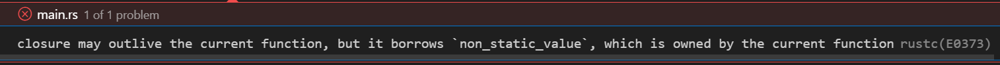
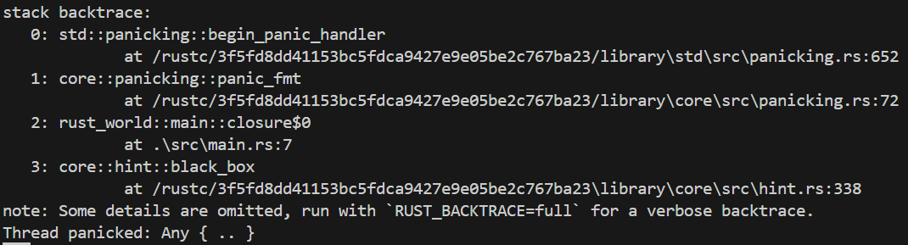
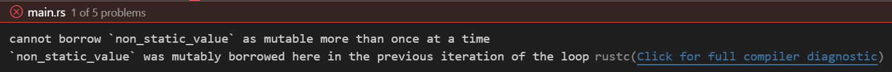

# 스레드 생성
러스트는 `std::thread::spawn`에 클로저나 함수를 전달해서 새로운 스레드를 시작할 수 있다.  
이때 클로저에 `move` 키워드를 사용하면 소유권을 클로저로 이동하게 되고, 그렇지 않으면 **기본 값으로 레퍼런스로 캡처**한다. 레퍼런스로 캡처할 때 주의할 점은 스레드가 레퍼런스의 원본보다 라이프 타임이 더 길다면, 컴파일 에러를 발생시킨다.  
`std::thread::spawn`으로 생성하는 스레드는 프로그램이 종료될 때까지 계속 실행될 수 있기 때문에 항상 static life time을 갖는 타입을 입력받는다.  
예를 들어 다음 코드는 컴파일 에러를 발생시킨다.
```rust
fn main() {
let non_static_value = 42;
        thread::spawn(|| {
            for i in 0..10 {
                println!("{}", i + non_static_value);
                thread::sleep(Duration::from_millis(10));
            }
        });
}
```
  

# 스레드 기다리기
스레드는 main 함수가 종료되면 다른 스레드들이 실행 중이더라도 프로그램을 종료한다.  
이를 막으러면 스레드가 종료될 때까지 스레드를 기다려야 한다. 그러기 위해서는 spawn에서 받은 `JoinHandle`을 사용해야 한다.
다음의 코드는 spawn된 스레드가 종료될 때까지 메인 스레드에서 `join`을 호출해서 동기적으로 기다린다.
```rust
fn main() {
    let t1 = std::thread::spawn(||{
        std::thread::sleep(Duration::from_secs(1));
        println!("Hello, world!");
    });
    
    t1.join().unwrap();
}
```
만약 스레드에서 패닉이 발생했다면 `join`은 패닉메시지를 포함시킨다.
다음의 코드는 Thread pacicked가 stack trace와 함께 출력된다.
```rust
fn main() {
    let t1 = std::thread::spawn(||{
        panic!("Panic");
    });
    
    // handle panic
    let result = t1.join();
    if let Err(e) = result {
        println!("Thread panicked: {:?}", e);
    }
}
```


> 만약 클로저가 값을 반환한다면, thread의 join에서 그 값을 받을 수 있다.  

> std::thread::spawn은 정확히는 std::thread::Builder::new().spawn().unwrap()을 간편하게 사용하기 위한 형태이다. `Builder`를 사용하면 스레드의 스택 메모리 크기를 지정하거나, 이름을 붙히는 등 다양한 설정을 할 수 있다.

> println! 매크로는 내부에서 std::io::Stdout::lock()을 통해 출력 결과를 스레드 세이프하게 만든다.

# 스레드 수명 제한하기
`std::thread::spawn`는 `'static` 라이프 타임을 가진다. 하지면 특정 범위에서만 존재할 수 있도록 `std::thread::scope`를 제공한다.  
scope는 범위 안에만 존재하기 떄문에 로컬 변수의 소유권을 빌려올 수 있다. 이 패턴을 사용하면 **스레드가 범위 밖으로 나가지 못하는 것이 보장**되어 `'static`이 아닌 인수도 받을 수 있게 된다.
다음의 예는 spawn으로 생성했을 때 컴파일 에러가 발생했었지만 scope를 사용해서 문제를 해결했다.
```rust
fn main() {
    let non_static_value = 42;
    std::thread::scope(|s| {
        for i in 0..10 {
            println!("{}", i + non_static_value);
            std::thread::sleep(Duration::from_millis(10));
        }
        
        s.spawn(|| {
            for i in 0..10 {
                println!("{}", i + non_static_value);
                std::thread::sleep(Duration::from_millis(10));
            }
        });
    });
}
```
scope는 현재 범위를 나타내는 인수를 받는다. 위의 예는 s를 말한다.  
이 인수를 사용해 spawn을 호출하면 스레드의 범위도 scope 범위 안에서만 존재하도록 제한 할 수 있다.  
위 예제에서는 non_static_value가 불변이기 때문에 동시에 접근 하는 것이 가능하다. 하지만 만약 mutable이었을 경우 컴파일 오류가 발생한다.


# 스레드의 자원 공유
static 변수는 특정 스레드에 종속되지 않는 변수를 만들 수 있다. static 변수는 프로그램 자체가 소유권을 가진다.  
static 변수는 일정한 Initializer를 가지며 프로그램이 시작되기 전에 생성된다.  
값의 할당을 누수하는 것도 방법이 될 수 있다. `Box::leak`함수를 사용하면 Box의 소유권을 해제하고 값이 드랍되지 않게 할 수 있다. 누수된 값은 프로그램이 종료될 때까지 존재하게 된다.
```rust
    let x: &'static [i32; 3] = Box::leak(Box::new([1, 2, 3]));

    thread::spawn(move || dbg!(x));
    thread::spawn(move || dbg!(x));
```
하지만 이름에서 알 수 있다시피 누구시키면 메모리가 누수된다.  

스레드 사이에서 데이터를 공유하기 위한 가잫 좋은 방법은 **소유권을 공유**하는 것이다. 이를 레퍼런스 카운팅이라고 한다.  
```rust
    let a = Rc::new([1,2,3]);
    let b = a.clone(); // 레퍼런스 카운트가 증가한다.
    assert_eq!(a.as_ptr(), b.as_ptr());
```
스레드 안정성이 보장되는 레퍼런트 타입이 필요할 경우에는 std::sync::Arc를 사용하면 된다.
주의해야 할 점은 일반 레퍼런스`&T` 처럼 다른 코드에서 소유권을 대여하고 있으면 원래 값의 수정이 불가능하다. 이는 레퍼런트 카운팅 포인터도 마찬가지다.

# 스레드 사이의 소유권 대여
러스트에서 값을 빌리는 방법은 두 가지가 있는데 하나는 `&`로 불변 레퍼런스로 받아오는 방법과, `&mut`로 가변 레퍼런스를 대여하는 방법이 있다.  
불변 레퍼런스의 경우 불변 레퍼런스를 통해 값을 바꾸는 걸 허용하지 않는다. 반대로 가변 레퍼런스는 값을 바꾸는게 가능하다. 그리고 가변 레퍼런스는 한 번에 하나의 가변 레퍼런스만 대여가 가능하다.  
